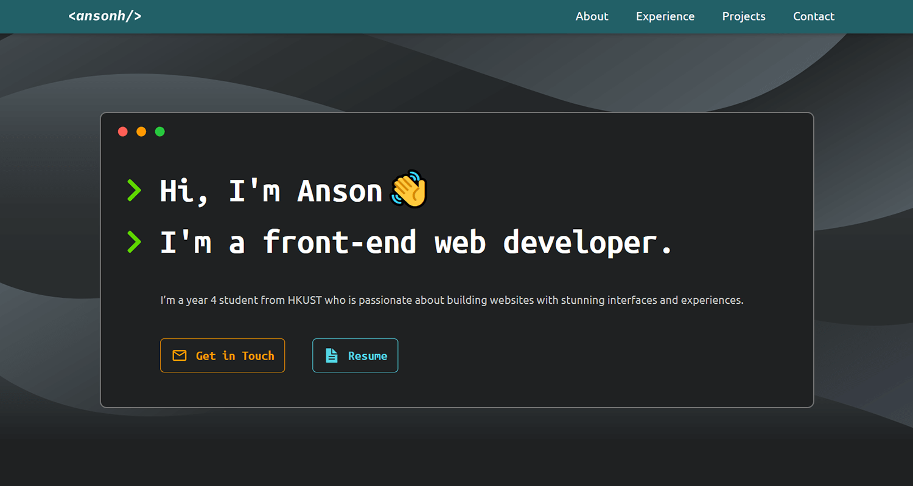

<h1 align="center">Personal Website v2</h1>

<p align="center">My personal website, built with <a href="https://www.gatsbyjs.com/">Gatsby</a> and hosted on <a href="https://www.netlify.com/">Netlify</a>.</p>

<p align="center">Visit here: <a href="https://www.ansonheung.me">https://www.ansonheung.me</a></p>

<div align="center">
  <a href="https://app.netlify.com/sites/anson-heung/deploys">
    
  </a>
</div>



## Development :hammer_and_wrench:

```bash
# 1. Install the Gatsby CLI & Yarn package manager if you haven't
npm install -g gatsby-cli yarn

# 2. Clone this repository
git clone https://github.com/AnsonH/personal-site-v2.git
cd personal-site-v2/

# 3. Install dependencies
yarn

# 4. Start the development server
gatsby develop
```

## Production Preview :rocket:

```bash
# 1. Build static assets
gatsby build

# 2. Preview the deployed site in localhost
gatsby serve
```

## What's New in v2? :bulb:

v2 is mostly a re-implementation of my [v1 Personal Website](https://github.com/AnsonH/AnsonH.github.io), which is created using HTML, Sass & Javascript. v2 includes minor improvements on the website design and accessibility.

Here are a few reasons why I re-implemented it using Gatsby:

- Increase maintainability because:
  - I can add/edit website content using markdown files instead of directly editing the HTML code
  - Components are split into their own JSX files
- Since I'll add a blog section in the future, using a static site generator makes a lot of sense
- To get more familiar with the Gatsby framework

## Special Thanks :pray:

The website design and this repo's structure are greatly inspired by [Brittany Chiang's personal website](https://brittanychiang.com/) ([GitHub repo](https://github.com/bchiang7/v4)). You should definitely check out her site :smile:
